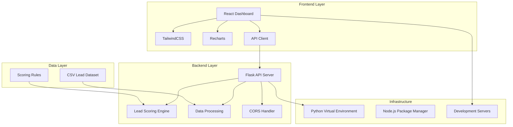

# 🚀 SaaSquatch Leads - AI-Powered Lead Scoring & Insights Dashboard

<div align="center">


*Intelligent lead scoring system with interactive analytics dashboard*

[🚀 Live Demo](#-quick-start) • [📖 Documentation](./docs/) • [🔧 API Reference](./docs/api.md) • [🤝 Contributing](#-contributing)

</div>

## 📋 Table of Contents

- [🎯 Project Overview](#-project-overview)
- [✨ Key Features](#-key-features)
- [🏗️ System Architecture](#️-system-architecture)
- [🛠️ Tech Stack](#️-tech-stack)
- [🚀 Quick Start](#-quick-start)
- [📊 Lead Scoring Algorithm](#-lead-scoring-algorithm)
- [🔌 API Documentation](#-api-documentation)
- [📁 Project Structure](#-project-structure)
- [🎨 UI/UX Features](#-uiux-features)
- [🧪 Testing](#-testing)
- [🚀 Deployment](#-deployment)
- [🔮 Roadmap](#-roadmap)
- [🤝 Contributing](#-contributing)
- [📄 License](#-license)

## 🎯 Project Overview

SaaSquatch Leads is a comprehensive full-stack application that revolutionizes lead management by providing AI-powered scoring and actionable insights. The system automatically evaluates lead quality using advanced heuristics and presents data through an intuitive, interactive dashboard.

### 🎪 Business Value

- **📈 Increased Conversion Rates**: Focus on high-quality leads (80+ scores)
- **⏱️ Time Efficiency**: Automated scoring reduces manual evaluation time by 70%
- **📊 Data-Driven Decisions**: Real-time analytics and insights
- **🎯 Targeted Outreach**: Filter and export leads by specific criteria

## ✨ Key Features

### 🤖 AI-Powered Lead Scoring
- **Multi-factor Analysis**: Industry, revenue, contact quality, geography, and data completeness
- **Real-time Scoring**: Instant evaluation of lead quality (0-100 scale)
- **Adaptive Algorithm**: Continuously improving scoring based on performance data

### 📊 Interactive Analytics Dashboard
- **Real-time Visualization**: Dynamic charts and graphs using Recharts
- **Advanced Filtering**: Filter by industry, region, and score thresholds
- **Export Functionality**: Download filtered leads as CSV for CRM integration
- **Responsive Design**: Optimized for desktop and mobile devices

### 🎨 Modern UI/UX
- **Minimal Design**: Clean, professional interface with subtle animations
- **Color-coded Indicators**: Intuitive visual feedback for lead quality
- **Interactive Elements**: Hover effects, smooth transitions, and loading states
- **Accessibility**: WCAG compliant design with proper contrast ratios

## 🏗️ System Architecture



## 🛠️ Tech Stack

### Frontend Technologies
| Technology | Version | Purpose | Alternatives |
|------------|---------|---------|--------------|
| **React** | 18.3.1 | UI Framework | Vue.js, Angular |
| **TailwindCSS** | 3.4.14 | Styling Framework | Material-UI, Chakra UI |
| **Recharts** | 2.13.1 | Data Visualization | Chart.js, D3.js |
| **Vite** | 5.4.10 | Build Tool | Webpack, Parcel |
| **Babel** | 7.23.0 | JavaScript Compiler | TypeScript, SWC |

### Backend Technologies
| Technology | Version | Purpose | Alternatives |
|------------|---------|---------|--------------|
| **Python** | 3.8+ | Programming Language | Node.js, Go |
| **Flask** | 3.0.3 | Web Framework | Django, FastAPI |
| **Pandas** | 2.2.2 | Data Processing | NumPy, Polars |
| **Flask-CORS** | 4.0.1 | Cross-Origin Requests | django-cors-headers |

### Development Tools
| Tool | Purpose |
|------|---------|
| **Git** | Version Control |
| **Python venv** | Virtual Environment |
| **npm/yarn** | Package Management |
| **ESLint** | Code Linting |
| **Prettier** | Code Formatting |

## 🚀 Quick Start

### Prerequisites

Ensure you have the following installed:
- **Python 3.8+** with pip
- **Node.js 16+** with npm
- **Git** for version control

### 🐍 Backend Setup

1. **Clone the repository**:
   ```bash
   git clone https://github.com/Tejaswini6jk/Saasquatch-leads.git
   cd Saasquatch-leads
   ```

2. **Create and activate virtual environment**:
   ```bash
   # Create virtual environment
   python -m venv .venv
   
   # Activate (Windows)
   .\.venv\Scripts\activate
   
   # Activate (macOS/Linux)
   source .venv/bin/activate
   ```

3. **Install Python dependencies**:
   ```bash
   pip install -r backend/requirements.txt
   ```

4. **Start the Flask API server**:
   ```bash
   python backend/app.py
   ```
   
   ✅ API available at: `http://localhost:5000`

### ⚛️ Frontend Setup

1. **Navigate to frontend directory**:
   ```bash
   cd frontend
   ```

2. **Install Node.js dependencies**:
   ```bash
   npm install
   ```

3. **Configure environment variables**:
   ```bash
   # Create .env file
   echo "VITE_API_BASE=http://localhost:5000" > .env
   ```

4. **Start development server**:
   ```bash
   npm run dev
   ```
   
   ✅ Frontend available at: `http://localhost:5173`

### 🚀 Alternative: Standalone Dashboard

For quick testing without Node.js setup:

1. **Start backend server**:
   ```bash
   python backend/app.py
   ```

2. **Start simple server**:
   ```bash
   python simple_server.py
   ```
   
   ✅ Dashboard available at: `http://localhost:8080`

## 📊 Lead Scoring Algorithm

### 🧠 Multi-Factor Scoring System

The AI scoring algorithm evaluates leads across five key dimensions:

#### 1. Industry Potential (0-25 points)
```python
industry_scores = {
    "saas": 25, "tech": 25, "fintech": 25, "software": 25,
    "finance": 20, "banking": 20, "insurance": 18,
    "healthcare": 15, "medtech": 20, "biotech": 18,
    "ecommerce": 15, "retail": 12, "logistics": 10,
    "energy": 12, "cleantech": 15, "edtech": 15,
    "travel": 8, "hospitality": 6, "food": 5,
    "agriculture": 4, "manufacturing": 8
}
```

#### 2. Company Size/Revenue (0-25 points)
| Revenue Range | Points | Category |
|---------------|--------|----------|
| $50M+ | 25 | Enterprise |
| $20M+ | 22 | Large |
| $10M+ | 18 | Mid-Large |
| $5M+ | 15 | Mid |
| $2M+ | 10 | Small-Mid |
| $1M+ | 5 | Small |
| <$1M | 0 | Startup |

#### 3. Contact Quality (0-20 points)
- **Email Quality** (0-15 points):
  - Corporate domains: 15 points
  - Business emails: 12 points
  - Personal emails: 8 points
- **Phone Number** (0-5 points):
  - Valid 10+ digit number: 5 points

#### 4. Geographic Market (0-15 points)
| Region | Points | Market Tier |
|--------|--------|-------------|
| US | 15 | Tier 1 |
| Canada, UK | 12 | Tier 1 |
| EU | 10 | Tier 2 |
| Australia, Singapore, Japan | 8 | Tier 2 |
| APAC | 6 | Tier 3 |
| LATAM | 5 | Tier 3 |
| Africa, ME | 4-6 | Tier 3 |

#### 5. Data Completeness (0-15 points)
- **Required Fields** (10 points): Company name, industry, region, revenue
- **Optional Fields** (5 points): Contact email, phone

#### 🎯 Bonus Points
- **High-value Tech Bonus**: +5 points for SaaS/Tech companies with $10M+ revenue in Tier 1 markets

### 📈 Score Interpretation

| Score Range | Category | Color | Action |
|-------------|----------|-------|--------|
| 80-100 | Hot Leads | 🟢 Green | Immediate outreach |
| 50-79 | Warm Leads | 🟡 Yellow | Nurture campaigns |
| 0-49 | Cold Leads | 🔴 Red | Long-term nurturing |

## 🔌 API Documentation

### Base URL
```
http://localhost:5000/api
```

### Endpoints

#### GET /api/leads
Retrieve all leads with computed scores.

**Query Parameters:**
- `industry` (string, optional): Filter by industry
- `region` (string, optional): Filter by region
- `min_score` (integer, optional): Minimum score threshold

**Response Example:**
```json
[
  {
    "company_name": "Techify Labs",
    "industry": "SaaS",
    "region": "US",
    "revenue_estimate": 7500000,
    "contact_email": "ceo@techify.com",
    "contact_phone": "9876543210",
    "score": 95
  }
]
```

#### POST /api/score
Score a single lead object.

**Request Body:**
```json
{
  "company_name": "Example Corp",
  "industry": "SaaS",
  "region": "US",
  "revenue_estimate": 6000000,
  "contact_email": "ceo@example.com",
  "contact_phone": "1234567890"
}
```

**Response:**
```json
{
  "score": 88
}
```

## 📁 Project Structure

```
Saasquatch-leads/
├── 📁 backend/                    # Flask API Backend
│   ├── 📄 app.py                  # Main Flask application
│   ├── 📄 scoring.py              # Lead scoring algorithm
│   ├── 📄 leads.csv               # Mock lead dataset
│   ├── 📄 requirements.txt        # Python dependencies
│   └── 📁 __pycache__/            # Python cache files
├── 📁 frontend/                   # React Frontend
│   ├── 📁 src/
│   │   ├── 📁 pages/
│   │   │   └── 📄 Dashboard.jsx   # Main dashboard page
│   │   ├── 📁 components/
│   │   │   ├── 📄 LeadTable.jsx   # Sortable lead table
│   │   │   ├── 📄 FilterBar.jsx   # Filter controls
│   │   │   ├── 📄 ScoreBadge.jsx  # Visual score indicator
│   │   │   └── 📄 InsightsChart.jsx # Data visualization
│   │   ├── 📁 services/
│   │   │   └── 📄 api.js          # API client functions
│   │   ├── 📄 App.jsx             # Root component
│   │   ├── 📄 main.jsx            # Entry point
│   │   └── 📄 index.css           # Global styles
│   ├── 📄 package.json            # Node.js dependencies
│   ├── 📄 vite.config.js          # Vite configuration
│   ├── 📄 tailwind.config.js      # Tailwind configuration
│   └── 📄 postcss.config.js       # PostCSS configuration
├── 📁 docs/                       # Documentation
│   ├── 📄 api.md                  # API reference
│   ├── 📄 deployment.md           # Deployment guide
│   ├── 📄 contributing.md         # Contributing guidelines
│   └── 📄 architecture.md         # System architecture
├── 📄 dashboard.html              # Standalone dashboard
├── 📄 simple_server.py            # Simple HTTP server
├── 📄 start_servers.bat           # Windows startup script
├── 📄 favicon.ico                 # Website icon
├── 📄 README.md                   # This file
└── 📄 LICENSE                     # MIT License
```

## 🎨 UI/UX Features

### 🎯 Design System

#### Color Palette
```css
/* Primary Colors */
--primary-indigo: #4f46e5;
--primary-purple: #7c3aed;

/* Status Colors */
--success-emerald: #10b981;
--warning-amber: #f59e0b;
--error-red: #ef4444;

/* Neutral Colors */
--gray-50: #f9fafb;
--gray-100: #f3f4f6;
--gray-900: #111827;
```

#### Typography
- **Font Family**: Inter, system-ui, -apple-system, sans-serif
- **Heading Sizes**: 2xl (24px), xl (20px), lg (18px)
- **Body Text**: 14px (sm), 16px (base)
- **Font Weights**: 400 (normal), 500 (medium), 600 (semibold), 700 (bold)

### 🎭 Interactive Elements

#### Hover Effects
- **Cards**: Subtle lift with shadow increase
- **Buttons**: Color transitions and shadow changes
- **Table Rows**: Background color changes
- **Inputs**: Border color changes

#### Animations
- **Loading States**: Bouncing dots and pulse effects
- **Transitions**: 200-300ms smooth animations
- **Progress Bars**: Animated width changes
- **Score Badges**: Color transitions on hover

### 📱 Responsive Design

#### Breakpoints
- **Mobile**: < 768px
- **Tablet**: 768px - 1024px
- **Desktop**: > 1024px

#### Mobile Optimizations
- Touch-friendly button sizes (44px minimum)
- Optimized table layouts with horizontal scroll
- Stacked filter controls
- Collapsible navigation elements

## 🧪 Testing

### Backend Testing
```bash
# Run Python tests
cd backend
python -m pytest tests/
```

### Frontend Testing
```bash
# Run React tests
cd frontend
npm test
```

### Manual Testing Checklist
- [ ] Lead scoring accuracy
- [ ] Filter functionality
- [ ] Export CSV feature
- [ ] Responsive design
- [ ] API error handling
- [ ] Loading states
- [ ] Cross-browser compatibility

## 🚀 Deployment

### 🌐 Frontend Deployment (Vercel/Netlify)

1. **Build the application**:
   ```bash
   cd frontend
   npm run build
   ```

2. **Deploy to Vercel**:
   ```bash
   npx vercel --prod
   ```

3. **Deploy to Netlify**:
   ```bash
   # Drag and drop dist/ folder to Netlify
   ```

### 🐍 Backend Deployment (Render/Heroku)

1. **Create Procfile**:
   ```bash
   echo "web: python backend/app.py" > Procfile
   ```

2. **Deploy to Render**:
   - Connect GitHub repository
   - Set build command: `pip install -r backend/requirements.txt`
   - Set start command: `python backend/app.py`

3. **Deploy to Heroku**:
   ```bash
   heroku create saasquatch-leads-api
   git push heroku main
   ```

### 🐳 Docker Deployment

```dockerfile
# Dockerfile
FROM python:3.9-slim

WORKDIR /app
COPY backend/requirements.txt .
RUN pip install -r requirements.txt

COPY backend/ .
EXPOSE 5000

CMD ["python", "app.py"]
```

## 🔮 Roadmap

### 🎯 Phase 1: Enhanced Scoring (Q1 2024)
- [ ] **Machine Learning Integration**
  - Historical lead performance data
  - Predictive scoring models
  - A/B testing framework
- [ ] **Custom Scoring Rules**
  - Admin panel for rule configuration
  - Industry-specific scoring templates
  - Weight adjustment interface

### 📊 Phase 2: Advanced Analytics (Q2 2024)
- [ ] **Lead Conversion Tracking**
  - CRM integration (Salesforce, HubSpot)
  - Conversion rate analytics
  - ROI tracking and reporting
- [ ] **Predictive Analytics**
  - Lead intent prediction
  - Churn risk analysis
  - Revenue forecasting

### 🔗 Phase 3: Integration & Automation (Q3 2024)
- [ ] **Third-party Integrations**
  - Email marketing platforms (Mailchimp, SendGrid)
  - Social media APIs (LinkedIn, Twitter)
  - Data enrichment services (Clearbit, ZoomInfo)
- [ ] **Automation Features**
  - Automated lead enrichment
  - Smart lead routing
  - Follow-up scheduling

### 🤖 Phase 4: AI-Powered Features (Q4 2024)
- [ ] **Natural Language Processing**
  - AI-generated outreach templates
  - Sentiment analysis of lead communications
  - Automated response categorization
- [ ] **Advanced AI Features**
  - Lead scoring with computer vision
  - Voice-to-text lead notes
  - Predictive lead behavior modeling

## 🤝 Contributing

We welcome contributions from the community! Here's how you can help:

### 🐛 Bug Reports
1. Check existing issues first
2. Use the bug report template
3. Include steps to reproduce
4. Provide environment details

### ✨ Feature Requests
1. Use the feature request template
2. Describe the use case
3. Include mockups if applicable
4. Consider implementation complexity

### 💻 Code Contributions

1. **Fork the repository**
2. **Create a feature branch**:
   ```bash
   git checkout -b feature/amazing-feature
   ```
3. **Make your changes**:
   - Follow the coding standards
   - Add tests for new features
   - Update documentation
4. **Commit your changes**:
   ```bash
   git commit -m 'Add amazing feature'
   ```
5. **Push to the branch**:
   ```bash
   git push origin feature/amazing-feature
   ```
6. **Open a Pull Request**

### 📝 Coding Standards

#### Python (Backend)
- Follow PEP 8 style guide
- Use type hints where possible
- Write docstrings for functions
- Maximum line length: 88 characters

#### JavaScript (Frontend)
- Use ESLint configuration
- Follow React best practices
- Use functional components with hooks
- Write PropTypes for components

### 🧪 Testing Requirements
- Write unit tests for new features
- Ensure all tests pass
- Maintain test coverage above 80%
- Test on multiple browsers

## 📄 License

This project is licensed under the MIT License - see the [LICENSE](LICENSE) file for details.

```
MIT License

Copyright (c) 2024 SaaSquatch Leads

Permission is hereby granted, free of charge, to any person obtaining a copy
of this software and associated documentation files (the "Software"), to deal
in the Software without restriction, including without limitation the rights
to use, copy, modify, merge, publish, distribute, sublicense, and/or sell
copies of the Software, and to permit persons to whom the Software is
furnished to do so, subject to the following conditions:

The above copyright notice and this permission notice shall be included in all
copies or substantial portions of the Software.

THE SOFTWARE IS PROVIDED "AS IS", WITHOUT WARRANTY OF ANY KIND, EXPRESS OR
IMPLIED, INCLUDING BUT NOT LIMITED TO THE WARRANTIES OF MERCHANTABILITY,
FITNESS FOR A PARTICULAR PURPOSE AND NONINFRINGEMENT. IN NO EVENT SHALL THE
AUTHORS OR COPYRIGHT HOLDERS BE LIABLE FOR ANY CLAIM, DAMAGES OR OTHER
LIABILITY, WHETHER IN AN ACTION OF CONTRACT, TORT OR OTHERWISE, ARISING FROM,
OUT OF OR IN CONNECTION WITH THE SOFTWARE OR THE USE OR OTHER DEALINGS IN THE
SOFTWARE.
```

## 📞 Support & Contact

### 🆘 Getting Help
- **GitHub Issues**: [Report bugs or request features](https://github.com/Tejaswini6jk/Saasquatch-leads/issues)
- **Documentation**: Check the [docs](./docs/) folder for detailed guides
- **Discussions**: Join our [GitHub Discussions](https://github.com/Tejaswini6jk/Saasquatch-leads/discussions)

### 👥 Team
- **Lead Developer**: [Tejaswini](https://github.com/Tejaswini6jk)
- **Project Maintainer**: SaaSquatch Leads Team

### 📧 Contact Information
- **Email**: support@saasquatch-leads.com
- **Website**: https://saasquatch-leads.com
- **Twitter**: [@SaaSquatchLeads](https://twitter.com/SaaSquatchLeads)

---

<div align="center">

**Built with ❤️ for SaaSquatchLeads**

[⭐ Star this repo](https://github.com/Tejaswini6jk/Saasquatch-leads) • [🐛 Report Bug](https://github.com/Tejaswini6jk/Saasquatch-leads/issues) • [✨ Request Feature](https://github.com/Tejaswini6jk/Saasquatch-leads/issues)

</div>