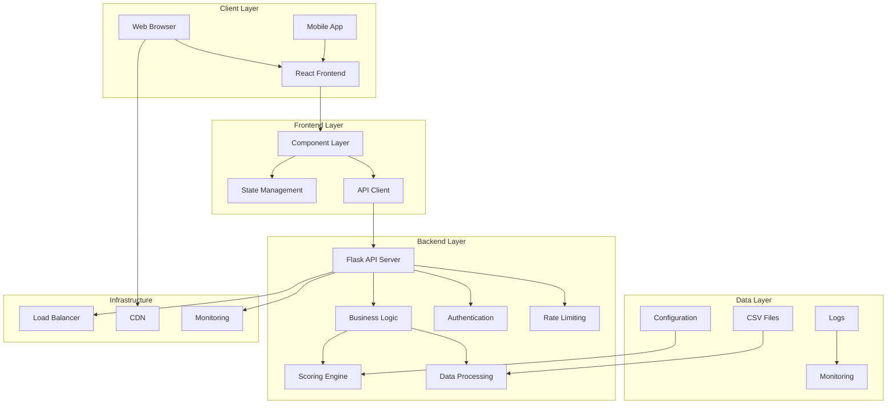
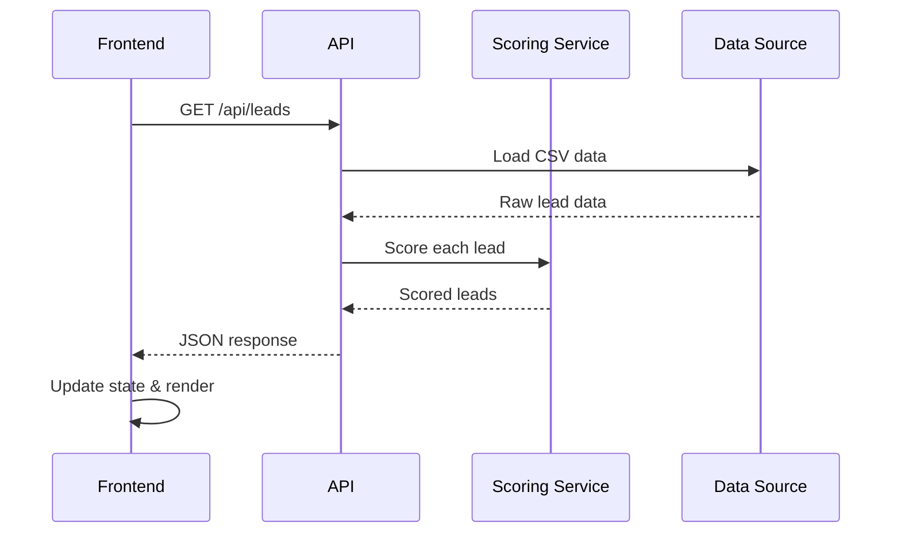
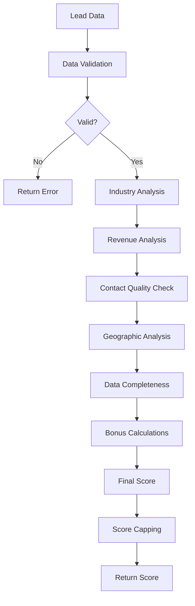

# 🏗️ System Architecture

This document provides a comprehensive overview of the SaaSquatch Leads system architecture, including technical decisions, design patterns, and scalability considerations.

## 📋 Table of Contents

- [System Overview](#system-overview)
- [Architecture Patterns](#architecture-patterns)
- [Component Design](#component-design)
- [Data Flow](#data-flow)
- [Security Architecture](#security-architecture)
- [Scalability Considerations](#scalability-considerations)
- [Technology Decisions](#technology-decisions)

## 🎯 System Overview

The SaaSquatch Leads application follows a modern full-stack architecture with clear separation of concerns between the frontend, backend, and data layers.

### High-Level Architecture



## 🏛️ Architecture Patterns

### 1. Model-View-Controller (MVC)

**Frontend (React)**:
- **Model**: State management with React hooks
- **View**: JSX components with TailwindCSS
- **Controller**: Event handlers and API calls

**Backend (Flask)**:
- **Model**: Data models and business logic
- **View**: JSON API responses
- **Controller**: Route handlers and request processing

### 2. Layered Architecture

```
┌─────────────────────────────────────┐
│           Presentation Layer        │  ← React Components
├─────────────────────────────────────┤
│           Business Logic Layer      │  ← Flask Routes & Services
├─────────────────────────────────────┤
│           Data Access Layer         │  ← Pandas & CSV Processing
├─────────────────────────────────────┤
│           Data Storage Layer        │  ← CSV Files & Configuration
└─────────────────────────────────────┘
```

### 3. RESTful API Design

The backend follows REST principles:
- **GET /api/leads**: Retrieve resources
- **POST /api/score**: Create new scoring operations
- **Stateless**: Each request contains all necessary information
- **Cacheable**: Responses include appropriate cache headers

## 🧩 Component Design

### Frontend Architecture

#### Component Hierarchy

```
App
├── Dashboard
│   ├── Navigation
│   ├── StatsCards
│   ├── FilterBar
│   ├── LeadTable
│   │   ├── ScoreBadge
│   │   └── SortableHeader
│   └── InsightsChart
│       ├── ScoreDistribution
│       └── QualityMetrics
└── ErrorBoundary
```

#### State Management

```javascript
// State structure
{
  leads: [],           // Raw lead data
  filteredLeads: [],   // Filtered lead data
  loading: boolean,    // Loading state
  error: string,       // Error messages
  filters: {           // Filter state
    industry: '',
    region: '',
    minScore: 0
  },
  sortKey: string,     // Current sort field
  sortDir: string,     // Sort direction
  searchQuery: string  // Search term
}
```

#### Component Patterns

1. **Container Components**: Dashboard (manages state)
2. **Presentation Components**: ScoreBadge, StatsCards
3. **Higher-Order Components**: ErrorBoundary
4. **Custom Hooks**: useLeads, useFilters

### Backend Architecture

#### Service Layer Pattern

```python
# Service layer structure
class LeadService:
    def get_leads(self, filters=None):
        """Retrieve and filter leads"""
        
    def score_lead(self, lead_data):
        """Score individual lead"""
        
    def export_leads(self, leads):
        """Export leads to CSV"""

class ScoringService:
    def calculate_score(self, lead):
        """Calculate AI score for lead"""
        
    def validate_lead_data(self, lead):
        """Validate lead data integrity"""
```

#### Repository Pattern

```python
class LeadRepository:
    def __init__(self, data_source):
        self.data_source = data_source
        
    def find_all(self):
        """Retrieve all leads"""
        
    def find_by_filters(self, filters):
        """Filter leads by criteria"""
        
    def save(self, lead):
        """Save lead data"""
```

## 🔄 Data Flow

### 1. Lead Loading Process



### 2. Lead Scoring Process



### 3. Real-time Filtering

```javascript
// Filter flow
useEffect(() => {
  let filtered = leads;
  
  // Apply industry filter
  if (filters.industry) {
    filtered = filtered.filter(lead => 
      lead.industry.toLowerCase().includes(filters.industry.toLowerCase())
    );
  }
  
  // Apply region filter
  if (filters.region) {
    filtered = filtered.filter(lead => 
      lead.region.toLowerCase().includes(filters.region.toLowerCase())
    );
  }
  
  // Apply score filter
  filtered = filtered.filter(lead => lead.score >= filters.minScore);
  
  setFilteredLeads(filtered);
}, [leads, filters]);
```

## 🔒 Security Architecture

### 1. Security Layers

```
┌─────────────────────────────────────┐
│        Application Security         │  ← Input validation, CORS
├─────────────────────────────────────┤
│        Network Security            │  ← HTTPS, Firewall rules
├─────────────────────────────────────┤
│        Infrastructure Security      │  ← Access controls, Monitoring
└─────────────────────────────────────┘
```

### 2. Input Validation

```python
def validate_lead_data(lead_data):
    """Validate lead data with security checks"""
    required_fields = ['company_name', 'industry', 'region', 'revenue_estimate']
    
    # Check required fields
    for field in required_fields:
        if not lead_data.get(field):
            raise ValueError(f"Missing required field: {field}")
    
    # Sanitize string inputs
    for field in ['company_name', 'industry', 'region']:
        if field in lead_data:
            lead_data[field] = sanitize_input(lead_data[field])
    
    # Validate numeric inputs
    if not isinstance(lead_data.get('revenue_estimate'), (int, float)):
        raise ValueError("Revenue estimate must be numeric")
    
    return lead_data
```

### 3. CORS Configuration

```python
from flask_cors import CORS

# Configure CORS for security
CORS(app, origins=[
    "http://localhost:3000",  # Development
    "http://localhost:5173",  # Vite dev server
    "https://your-domain.com" # Production
])
```

### 4. Rate Limiting

```python
from flask_limiter import Limiter
from flask_limiter.util import get_remote_address

limiter = Limiter(
    app,
    key_func=get_remote_address,
    default_limits=["1000 per hour"]
)

@app.route('/api/score', methods=['POST'])
@limiter.limit("100 per hour")
def score_lead():
    # Scoring endpoint with rate limiting
    pass
```

## 📈 Scalability Considerations

### 1. Horizontal Scaling

#### Frontend Scaling
- **CDN Distribution**: Static assets served from CDN
- **Code Splitting**: Lazy load components to reduce bundle size
- **Caching**: Browser caching for static resources

#### Backend Scaling
- **Load Balancing**: Distribute requests across multiple instances
- **Stateless Design**: No server-side session storage
- **Database Connection Pooling**: Efficient database connections

### 2. Performance Optimization

#### Frontend Optimizations
```javascript
// Memoization for expensive calculations
const memoizedLeads = useMemo(() => {
  return leads.map(lead => ({
    ...lead,
    score: calculateScore(lead)
  }));
}, [leads]);

// Debounced search
const debouncedSearch = useCallback(
  debounce((query) => {
    setSearchQuery(query);
  }, 300),
  []
);
```

#### Backend Optimizations
```python
# Caching for frequently accessed data
from functools import lru_cache

@lru_cache(maxsize=128)
def get_industry_score(industry):
    """Cache industry scoring calculations"""
    return industry_scores.get(industry.lower(), 5)

# Async processing for heavy operations
import asyncio

async def process_leads_batch(leads):
    """Process leads asynchronously"""
    tasks = [score_lead_async(lead) for lead in leads]
    return await asyncio.gather(*tasks)
```

### 3. Database Migration Strategy

When moving from CSV to database:

```python
# Database abstraction layer
class DataStore:
    def __init__(self, storage_type='csv'):
        if storage_type == 'csv':
            self.storage = CSVStorage()
        elif storage_type == 'database':
            self.storage = DatabaseStorage()
    
    def get_leads(self, filters=None):
        return self.storage.get_leads(filters)
```

## 🛠️ Technology Decisions

### Frontend Technology Choices

| Technology | Decision | Rationale | Alternatives Considered |
|------------|----------|-----------|------------------------|
| **React** | ✅ Chosen | Component-based, large ecosystem, great tooling | Vue.js, Angular |
| **TailwindCSS** | ✅ Chosen | Utility-first, rapid development, consistent design | Material-UI, Chakra UI |
| **Recharts** | ✅ Chosen | React-native, good performance, active maintenance | Chart.js, D3.js |
| **Vite** | ✅ Chosen | Fast build times, HMR, modern tooling | Webpack, Create React App |

### Backend Technology Choices

| Technology | Decision | Rationale | Alternatives Considered |
|------------|----------|-----------|------------------------|
| **Flask** | ✅ Chosen | Lightweight, flexible, easy to extend | Django, FastAPI |
| **Pandas** | ✅ Chosen | Excellent data processing, CSV handling | NumPy, Polars |
| **Python 3.9+** | ✅ Chosen | Rich ecosystem, data science libraries | Node.js, Go |

### Architecture Trade-offs

#### CSV vs Database
- **CSV**: ✅ Simple, no setup required, good for MVP
- **Database**: ❌ More complex, requires setup, better for production

**Decision**: Start with CSV, plan migration to database

#### Monolith vs Microservices
- **Monolith**: ✅ Simple deployment, easier development
- **Microservices**: ❌ Complex orchestration, overkill for current scale

**Decision**: Monolithic architecture with clear service boundaries

#### Client-side vs Server-side Rendering
- **CSR**: ✅ Rich interactions, faster navigation, better UX
- **SSR**: ❌ Slower interactions, more complex state management

**Decision**: Client-side rendering with React

## 🔮 Future Architecture Evolution

### Phase 1: Enhanced Backend
- Database integration (PostgreSQL)
- Redis for caching
- Message queue for async processing

### Phase 2: Microservices
- Separate scoring service
- User management service
- Analytics service

### Phase 3: Cloud-Native
- Kubernetes deployment
- Service mesh (Istio)
- Event-driven architecture

### Phase 4: AI/ML Integration
- ML model serving
- Feature store
- Model monitoring

This architecture document provides a comprehensive view of the system design and serves as a foundation for future development and scaling decisions.
